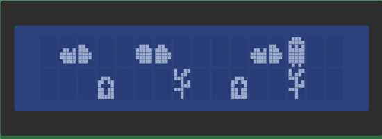
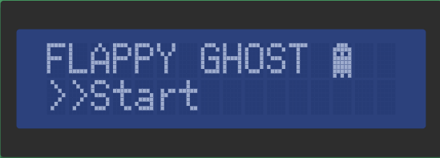
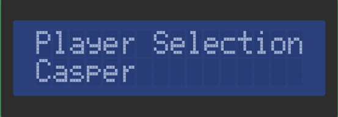
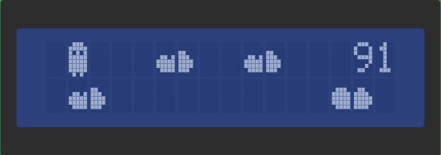
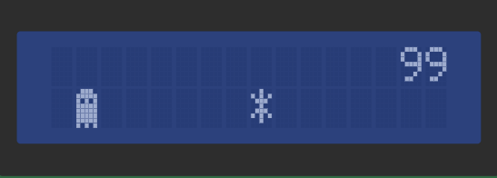

# Flappy_Ghost-Game
Jogo desenvolvido para Arduino em Linguagem C
[Jogo no Tinkercad][tinkercad]

## Contexto
O jogo se baseia em um personagem que vaga pela céu a noite em busca de coletar a estrela que lhe guiará à luz. Entretanto o personagem se depara com nuvens no seu caminho atrapalhando sua jornada, caso o fantasma esbarre em uma nuvem ele retorna ao 
corpo, renascendo e perdendo o jogo.

## Jogabilidade
* Botão 1 - Navegação no menu
* Botão 2 - Seleção
* Sensor de Inclinação - Movimentação do personagem

## Instruções
* Inicialmente escolha um dos três personagens para jogar, assim sua maior pontuação ficará salva naquele personagem.
* O personagem se movimenta apenas verticalmente, de acordo com a inclinação do sensor de rotação. 
* Os obstáculos(nuvens) se aproximam do personagem aumentando a velocidade com o decorrer do jogo.
* A cada nuvem desviada o player ganha 1 ponto.
* Ao chegar a 99 pontos, uma estrela se aproxima e para vencer o jogo é necessário pega-la.

## Desenvolvedores
* [Thainá Weingartner][thaina]

[tinkercad]:https://www.tinkercad.com/things/hMk3Oi6fhR6
[thaina]:https://github.com/thainaweingartner
